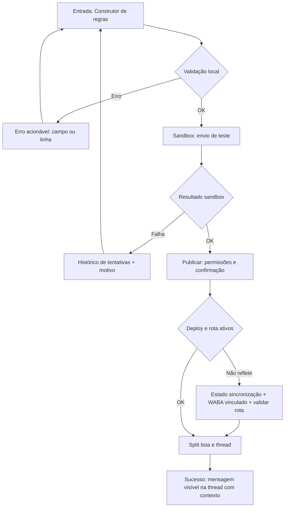
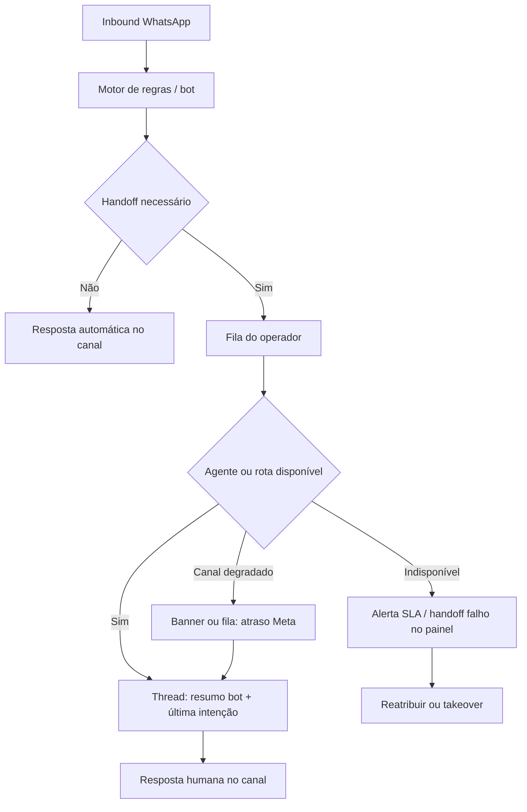
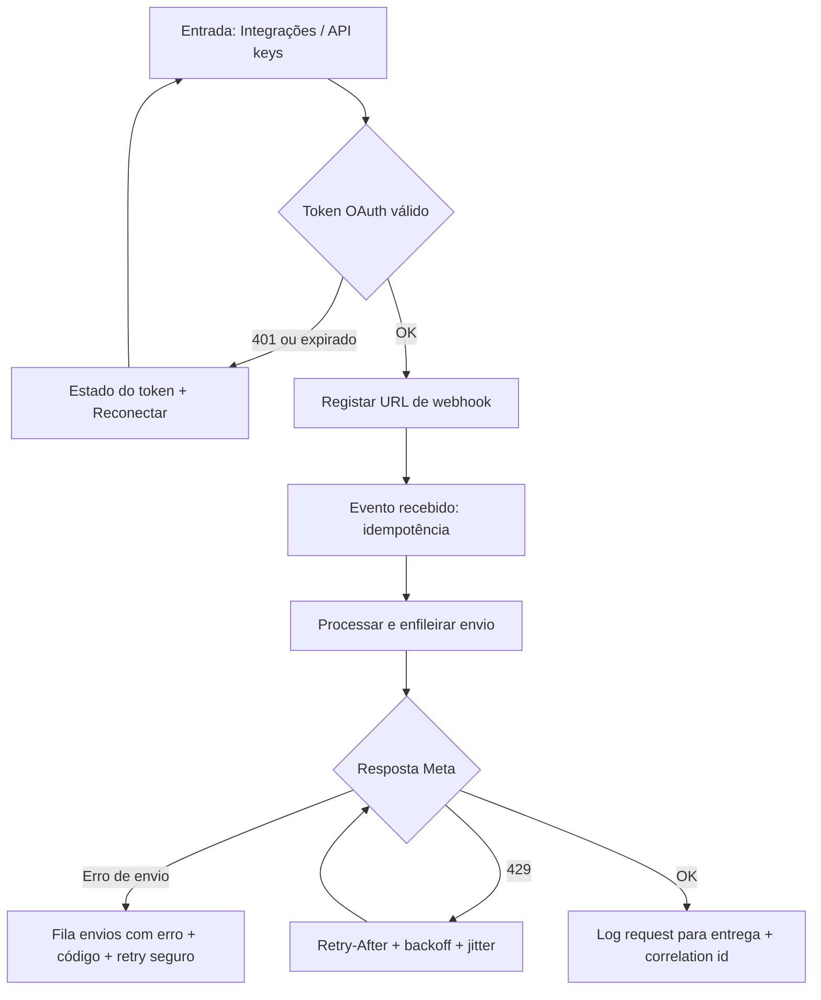
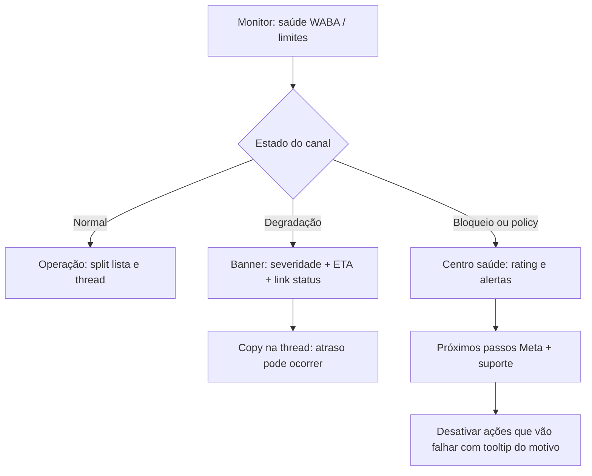

---
stepsCompleted:
  - step-01-init.md
  - step-02-discovery.md
  - step-03-core-experience.md
  - step-04-emotional-response.md
  - step-05-inspiration.md
  - step-06-design-system.md
  - step-07-defining-experience.md
  - step-08-visual-foundation.md
  - step-09-design-directions.md
  - step-10-user-journeys.md
inputDocuments:
  - _bmad-output/planning-artifacts/prd.md
  - _bmad-output/planning-artifacts/prd-decisoes-registradas-gd-agk.md
  - _bmad-output/planning-artifacts/product-brief-autocontrollerbot.md
  - _bmad-output/planning-artifacts/product-brief-autocontrollerbot-distillate.md
  - _bmad-output/planning-artifacts/research/platform-MR-DR-TR-aprofundado-2026-04-17.md
  - _bmad-output/planning-artifacts/research/platform-openbsp-skus-MR-DR-TR-2026-04-17.md
  - docs/index.md
  - docs/modular/README.md
  - docs/modular/00-caso-e-escopo.md
  - docs/modular/01-arquitetura-reativa-visao-geral.md
  - docs/modular/02-rotina-whatsapp-webhook.md
  - docs/modular/03-rotina-mensagens-triggers-edge.md
  - docs/modular/04-rotina-agent-client.md
  - docs/modular/05-rotina-whatsapp-dispatcher.md
  - docs/modular/06-rotina-media-preprocessor.md
  - docs/modular/07-rotina-whatsapp-management.md
  - docs/modular/08-rotina-mcp-servidor-api.md
  - docs/modular/09-rotina-webhooks-saida-integracoes.md
  - docs/modular/10-rotina-deploy-ci-billing-vault.md
  - docs/modular/11-extensoes-rag-n8n-aprendizado.md
  - docs/modular/12-apendice-rotas-http-e-contratos.md
  - docs/modular/13-notify-webhook-semantica-e-riscos.md
  - docs/modular/14-contatos-onboarding-e-rls.md
  - docs/modular/15-mcp-servidor-catalogo-ferramentas.md
  - docs/modular/98-party-mode-perspectivas-rota.md
  - docs/modular/99-elicitacao-pre-mortem-e-riscos.md
  - docs/modular/100-elicitacao-metodos-adicionais.md
  - _bmad-output/planning-artifacts/architecture.md
  - _bmad-output/planning-artifacts/prd-decisoes-pendentes-party-mode.md
  - CLAUDE.md
workflowType: ux-design
project_name: open-bsp-api
user_name: GD-AGK
date: '2026-04-17'
documentCounts:
  prd: 1
  productBriefs: 2
  research: 2
  projectDocs: 21
  projectContext: 0
  inputDocumentsTotal: 34
elicitationStep2:
  methods: "Cross-Functional War Room (implícito nas três vozes); Party Mode (Sally, Winston, John); síntese orchestrator"
  date: "2026-04-17"
elicitationStep3:
  methods: "Pre-mortem Analysis (Mary); Party Mode (Sally, Winston, John); síntese orchestrator"
  date: "2026-04-17"
elicitationStep4:
  methods: "Socratic Questioning (Mary); Party Mode (Sally, Winston, John); síntese orchestrator"
  date: "2026-04-17"
elicitationStep5:
  methods: "Comparative Analysis Matrix (Mary); Party Mode (Sally, Winston, John); síntese orchestrator"
  date: "2026-04-17"
elicitationStep6:
  methods: "First Principles Analysis (Mary); Party Mode (Sally, Winston, John); síntese orchestrator"
  date: "2026-04-17"
elicitationStep7:
  methods: "5 Whys Deep Dive (Mary); Party Mode (Sally, Winston, John); síntese orchestrator"
  date: "2026-04-17"
elicitationStep8:
  methods: "Critique and Refine (Mary); Party Mode (Sally, Winston, John); síntese orchestrator"
  date: "2026-04-17"
elicitationStep9:
  methods: "Comparative Analysis Matrix (Mary); Party Mode (Sally, Winston, John); síntese orchestrator"
  date: "2026-04-17"
elicitationStep10:
  methods: "Failure Mode Analysis (Mary); Party Mode (Sally, Winston, John); síntese orchestrator"
  date: "2026-04-17"
uxDesignArtifacts:
  designDirectionsHtml: _bmad-output/planning-artifacts/ux-design-directions.html
uiStack:
  componentLibrary: Chakra UI
  webTarget: SPA React (admin e clientes; WhatsApp permanece canal do utilizador final)
  mobileFuture: Capacitor para Android e iOS ? mesma base de componentes e comportamentos, sem duplicação de UI; ajustes esperados em config/plugins nativos
---

# UX Design Specification open-bsp-api

**Author:** GD-AGK
**Date:** 2026-04-17

---

## Revisão passo 1 (Advanced Elicitation + Party Mode, 2026-04-17)

Síntese para fechar lacunas de **inputs** antes do passo 2 (discovery):

| Prioridade | Ação sugerida |
|------------|-----------------|
| **Must** | Incluir `prd-decisoes-pendentes-party-mode.md` no bundle **ou** resumir no spec os defaults assumidos para UX (MVP/embed/SSO/versionamento). |
| **Must** | `project-context.md` ausente ? gerar (`bmad-generate-project-context`) ou equivalente e referenciar em `inputDocuments`. |
| **Must** | Explícito: superfícies (web, iframe/embed, futuro Capacitor), papéis (admin plataforma / operador tenant / final) e alvo mínimo de acessibilidade ? capturar no passo 2 se ainda não fechado. |
| **Should** | Ligar `architecture.md` quando tiver decisões que limitem UI (tenancy, OAuth, filas, limites de API). *(Feito: `architecture.md` e pendentes no bundle.)* |
| **Should** | 3?5 métricas de **tarefa** alinhadas a gates do piloto; stakeholders com veto em UX para sessões de descoberta. |
| **Nice** | `CLAUDE.md` / README como contexto operacional; referências competitivas com ecrã; nota de escopo PWA/admin vs app nativa no `uiStack`. |

**Advanced Elicitation:** oferta padrão de métodos (1?5 / r / a / x) fica disponível para secções futuras.

---

## Executive Summary (passo 2 ? Project Understanding)

*Síntese colaborativa (Party Mode: Sally, Winston, John) com enquadramento **Cross-Functional War Room** (produto × engenharia × UX). Documentos-base: PRD, `prd-decisoes-pendentes-party-mode.md`, `architecture.md`, stack Chakra + futuro Capacitor.*

### Project Vision

- Plataforma **multitenant B2B/B2B2B** no ecossistema WhatsApp Business (BSP): **inbox unificada**, **chatbot por regras** no MVP, **painel embedded**; canal **só WhatsApp** na v1; evolução para **agente inteligente (F2)** e **orquestrador de integrações (F3)** com gates explícitos ? a UI não deve ?antecipar? F2/F3 como se já existissem.
- **Promessa honesta:** valor mensurável no piloto (BSP + regras + embed); **transparência sobre volatilidade Meta** e dependências de canal como parte da confiança, não como desculpa técnica.
- **Diferenciação vivida pelo operador:** controlo fino (regras hoje, orquestração amanhã), **handoff** claro e **saúde do tenant** legível; **stack alvo** (FastAPI, PostgreSQL, OAuth/OIDC) traduz-se em contas, permissões e auditoria compreensíveis.
- **Superfícies:** web admin/clientes em **React + Chakra UI**; **embed** (iframe/SDK/profundidade TBD); **Capacitor** no horizonte para Android/iOS com a **mesma base** de UI, cuidando WebView, sessão e safe areas.

### Target Users

| Papel | Necessidade central (UX) |
|--------|---------------------------|
| **Comprador / sponsor** | Narrativa de valor e risco; prova de ROI e adoção; não só lista de funcionalidades. |
| **Operador / admin do tenant** | Configurar e publicar fluxos **sem engenharia**; inbox/embed no contexto do cliente; autonomia com guardrails. |
| **Consumidor final (B2B2C)** | Resposta útil rápida; **sair do bot** para humano sem fricção; linguagem clara (sem jargão de sistema). |
| **Integrador** | OAuth, webhooks, erros documentados ? ?time-to-first-success? como prova de experiência técnica. |
| **Parceiro / revenda (se em escopo)** | Visão delegada sem cruzar dados entre tenants ? impacta navegação e empty states (**TBD** por fase). |

**TBD:** RBAC mínimo no MVP (papéis e ?viewer?); jornada de parceiro B2B2B na v1.

### Key Design Challenges

- **Modelo mental multitenant:** organização ? WABA/conta ? conversas; breadcrumbs e contexto para evitar vazamento de dados e confusão de contexto.
- **Embedded × SSO (linhas 1 e 13 das pendentes):** continuidade de sessão, quem ?pinta? o login (host vs iframe), profundidade **SAML/OIDC enterprise** vs OAuth do tenant só no piloto ? **protótipo estreito** até decisão; evitar congelar árvores de menu ?cascata? se o MVP for **motor genérico + UX mínima**.
- **Motor de regras:** preview, simulação e erros legíveis ? confiança antes de publicar; **versionamento (linha 11):** piso seguro **publicado vs rascunho + auditoria**; diff visual / rollback one-click só se a decisão fechar além disso.
- **Meta indisponível / 429 / filas:** justiça entre tenants e mensagens **honestas e acionáveis** para operador (e política do que o consumidor final vê vs só backoffice).
- **LGPD e copy:** consentimento e bases legais integrados nos fluxos de conversa e no painel, não só checkbox terminal.
- **Brownfield / migração:** dois runtimes até paridade ? UX deve alinhar-se a marcos técnicos sem prometer paridade visual antes dos gates.

### Design Opportunities

- **Painel embedded como hábito:** atalhos, retorno ao inbox, notificações in-app ? reduzir ?login esquecido?.
- **Handoff bot ? humano** como diferencial de percepção de qualidade (estado visível, fila, SLA quando aplicável).
- **Saúde do tenant** em linguagem humana (limites Meta, fila, webhooks, incidentes) ? transformar SLIs em **ação**, não em dashboard de ops genérico.
- **Onboarding guiado por valor:** primeiro fluxo publicado, primeira conversa, primeira métrica ? alinhado a métricas de **tarefa** do piloto.
- **Design system (Chakra + tokens):** gatilho ? condição ? ação ? teste reutilizável acelera F2/F3 sem multiplicar padrões; prepara **Capacitor** sem bifurcar o produto.

### Métricas de tarefa (alinhamento piloto; calibrar com 1.º tenant)

1. **Publicar fluxo:** taxa de conclusão até ?publicado? sem erro; tempo p50/p90 da edição ao publish.  
2. **Primeira resposta útil (consumidor):** p50/p90 (definição operacional de ?útil?).  
3. **Resolver só com regra:** % conversas fechadas sem handoff (quando mensurável).  
4. **Primeira ação útil no embed (operador):** p95 tempo até ação útil.  
5. **Confiança canal:** incidentes de integração Meta por 1k mensagens.

### Advanced Elicitation + Party Mode (registo do passo 2)

- **Cross-Functional War Room:** tensões produto (John: gates MVP/F2/F3, linhas 1/11/13), engenharia (Winston: embed/WebView/Capacitor, 429, SLIs, versionamento), experiência (Sally: inbox como centro de gravidade, handoff, LGPD).  
- **TBDs cruzados:** ver subsecções acima e tabela de pendentes PRD; wireframes ?finais? das áreas **cascata / diff de versão / SSO enterprise** ficam **condicionados** a decisão explícita.

---

## Core User Experience (passo 3)

*Elaboração com **Advanced Elicitation** (Pre-mortem ? Mary) e **Party Mode** (Sally, Winston, John).*

### Defining Experience

- **Proposição central:** o WhatsApp deixa de ser caixa preta ? conversas e estados **visíveis e governáveis** numa **mesa única** (inbox + regras + embed), com automação **por regras** controlável **sem engenharia** no MVP.
- **Loop do operador (crítico):** **desenhar ? testar/preview ? publicar ? operar** com inbox como **centro de gravidade**; o consumidor no canal: **mensagem ? resposta útil por regras ? handoff claro para humano** quando fizer sentido.
- **Confiança no canal:** estados de fila, Meta indisponível e **429** são **primeira classe** na UI ? honestidade operacional, não ?tudo verde? quando o sistema ou o canal estão sob stress.
- **Superfícies:** uma árvore de produto (**React + Chakra**), várias embalagens (**SPA**, **embed**, futuro **Capacitor**); paridade de **estados e contratos de erro**, não necessariamente de bundle ou cold start.
- **TBD (produto/UX):** profundidade do embed vs faixa mínima; **SSO enterprise (SAML/OIDC)** vs OAuth do tenant no piloto (pendente #13); **UI ?cascata?** vs motor genérico (pendente #1).

### Platform Strategy

| Superfície | Papel |
|------------|--------|
| **Web SPA** | Baseline de layout, tokens Chakra, a11y e métricas de tarefa do piloto. |
| **Embed (iframe/SDK)** | Mesmo bundle e semântica; isolamento por **origem**, política explícita de **cookies / sessão** (terceiros), contrato **postMessage** com o host quando aplicável. |
| **Capacitor (futuro)** | Mesma app em **WebView**; paridade de **comportamento** (login, troca tenant/WABA, indisponível); ajustes **safe area**, teclado, deep link de retorno OAuth ? sem bifurcar regras de negócio (?modo embed? só com ADR). |

- **Sessão:** OIDC/OAuth do tenant no piloto vs **SSO enterprise** ? a UI não assume um único fluxo até decisão; **logout** limpa estado e caches; dados sensíveis **ancorados** ao tenant ativo no token.
- **429 / fairness:** consumir **429 + Retry-After** (ou equivalente); copy **acionável**; saúde **do próprio tenant** em incidente; backoff no cliente para evitar storm em painel 24/7.
- **Bundle Chakra:** tree-shaking, tema por tokens; chunk de embed pode ser **mais agressivo** (menos rotas) sem fork de componentes.
- **Observabilidade (UI):** eventos de produto com `tenant_id`, `surface` (web \| embed \| capacitor), outcome; erros categorizados + request id; CWV em rotas críticas; **tempo até primeira interação útil** no embed alinhado à métrica de tarefa.

### Effortless Interactions

- **Inbox:** poucos cliques entre lista, detalhe da thread e ação seguinte; **retorno previsível** ao embed.
- **Regras:** blocos legíveis **gatilho ? condição ? ação ? teste**; validação **antes** de publicar; erros com **campo** e sugestão ? não stack trace.
- **Publicação segura:** **rascunho vs publicado** + auditoria mínima; **TBD** diff visual e rollback one-click além do piso (pendente #11).
- **Handoff:** transição **visível** para operador e consumidor; copy **sem jargão** para o final.
- **Integração:** caminho curto a **primeiro sucesso** (OAuth, webhook, primeiro evento) com feedback explícito.

### Critical Success Moments

*(Cruzamento com **Pre-mortem**: estados bot/humano visíveis; isolamento multitenant; ?resposta útil? definida; qualidade pré-publicação; embed performático; mobile não adiado como armadilha; transparência com níveis de disclosure.)*

1. **Primeiro fluxo publicado fim-a-fim (sem suporte)** ? nasce adoção e narrativa de controlo (gate: qualidade de fluxo / proxies de abandono ou loop).
2. **Primeira conversa na inbox com contexto completo** ? operador **confia** que está na WABA/conta certa (make-or-break multitenant).
3. **Primeira ação útil no embed (p95)** ? hábito de uso no contexto do cliente; **TBD** definir ?ação mínima? até fechar profundidade do embed.
4. **Handoff que preserva NPS** ? consumidor não repete tudo nem fica em limbo; operador vê fila e posse.
5. **Dia mau de Meta / API** ? painel **explica e orienta**; falha genérica silenciosa = experiência quebrada (alinhado a SLIs e incidentes/1k mensagens).
6. **Sponsor / comprador** ? **antes/depois** mensurável (horas, resolução) até **go/no-go** com baseline fechada.

### Experience Principles

1. **Contexto antes de recurso** ? tenant, WABA e conversa **inequívocos**; nunca optimizar velocidade à custa de ambiguidade de dados.
2. **Honestidade operacional** ? filas, limites Meta e dependências como estado de sistema, não rodapé técnico.
3. **Publicar é ritual seguro** ? validação/preview; caminho de mitigação/reversão alinhado à decisão de versionamento.
4. **Duas audiências, uma disciplina de linguagem** ? operador: precisão e auditoria; consumidor: clareza e calma.
5. **Chakra como contrato** ? tokens e componentes partilhados entre web, embed e futuro Capacitor; evitar **hover** como ação crítica onde WebView/mobile importa.
6. **Transparência com níveis** ? o que mostrar em erro vs em operação normal; em cada momento crítico, **o que o operador vê** vs **o que o consumidor vê** no WhatsApp.

### Registo Advanced Elicitation + Party Mode (passo 3)

- **Pre-mortem (Mary):** mitigações incorporadas em estados conversação, isolamento embed, definição de ?útil?, guardrails de publicação, orçamento de performance do embed, riscos Capacitor cedo, disclosure por audiência.
- **Party Mode:** **Sally** (mesa única, handoff, princípios e TBDs); **Winston** (superfícies, sessão, 429, Chakra, telemetria); **John** (gates piloto, loops por papel, momentos críticos ? métricas de tarefa).

---

## Desired Emotional Response (passo 4)

*Elaboração com **Advanced Elicitation** (**Socratic Questioning** ? Mary) e **Party Mode** (Sally, Winston, John).*

### Primary Emotional Goals

- **Controle informado** ? ?Estou no controlo da operação? sem precisar de ser engenheiro de infra; tenant, fila, limites e o que está **ativo agora** são legíveis.
- **Confiança interop** ? ?Confio na ponte com a Meta? de forma **informada**: fronteira clara entre o que a plataforma garante e o que depende do canal externo (tokens, políticas, janelas).
- **Dignidade em falha** ? ?Quando quebra, não me sinto burro nem traído?; erros honestos, acionáveis, sem culpar o operador por defeito; separar falha técnica de julgamento pessoal.
- **Ritual profissional** ? ?Fluxo repetível, não herói de plantão?: inbox + regras com sensação de **previsibilidade e auditoria**, não improviso a cada incidente.
- **Alívio + previsibilidade (comprador)** ? renovação sustentada por **risco baixo e clareza de entrega/custo/escala**, não por ?dashboard bonito?.
- **Parceria em incidentes** ? dependência Meta comunicada cedo, sem jargão defensivo; ?estamos no mesmo barco? **com** ações locais (filas, fallback, regras).

### Emotional Journey Mapping

| Fase | Resposta emocional desejada | Âncoras de UX |
|------|----------------------------|---------------|
| **Descoberta / onboarding** | Curiosidade + alívio (?auditável e extensível?); primeiro tenant/contexto visível; distinção clara API vs painel. | Onboarding honesto; checkpoints OAuth/embed (?aguardando Meta?, callback recebido). |
| **Core (dia a dia)** | Foco calmo + **alerta saudável** (vigilância sem paranoia); sensação de mesa de trabalho única. | Inbox com estado da conversa; regras com prioridade/último match/erro; badges Chakra consistentes. |
| **Após tarefa** | Fechamento ? ?ficou registado?; efeito da ação visível (enfileirado, regra disparou, embed completou passo). | Confirmações que ligam ação ? efeito; trilho de auditoria quando aplicável. |
| **Erro (Meta, token, webhook, 429)** | Frustração **canalizada**: surpresa curta, depois clareza; **calma informada**, não alarmismo nem otimismo falso. | Resumo humano + detalhe técnico colapsável + **uma** ação recomendada; `Retry-After`; request id; mapa causa ? passo verificável. |
| **Retorno ao produto** | Retomada rápida; mesmo mapa mental (tenant, inbox, regras). | Persistência de contexto; último workspace/canal; evitar ?perder o fio? ao mudar de tenant. |

### Micro-Emotions

| Par desejado | Notas |
|--------------|--------|
| **Confiança** > medo paranoico | Isolamento multitenant explícito; prova de ?a minha marca está segura? (papéis, auditoria, LGPD). |
| **Clareza** > opacidade | O que o bot faz vs o que a Meta controla; incidentes classificados (`meta` / `plataforma` / `cliente`). |
| **Controle** > impotência | Sempre uma ação possível diante de erro; evitar só ?tente novamente? sem contexto. |
| **Profissionalismo** > infantilização | Tom B2B; evitar celebrações vazias em contexto compliance. |
| **Alívio cognitivo** > adivinhação | Menos decisões implícitas; rótulos de estado e ?porquê? numa linha. |
| **Segurança psicológica** | Erro interno recuperável sem vergonha; bugs de plataforma não vestidos como culpa do operador. |

**Emoções a evitar:** ansiedade crônica por alertas sem priorização; vergonha/culpa desproporcional; cinismo por promessa opaca sobre a Meta; surpresa negativa (cliente final descobre mudança antes do admin); **sucesso otimista na UI com falha nos bastidores**; mensagens vagas culpabilizantes.

### Design Implications

| Emoção / meta | Escolha de UX |
|---------------|----------------|
| **Controle multitenant** | Hierarquia explícita org ? WABA ? número/app; troca de contexto sem apagar histórico mental; breadcrumbs. |
| **Confiança do sponsor** | Métricas alinhadas à realidade do operador (webhooks rejeitados vs entregues, refresh de token); coerência painel ? suporte. |
| **Handoff no canal** | Consumidor: mensagens curtas e honestas se envio falhar; operador: estado aceito / enfileirado / bloqueado ? sem silêncio nem sucesso falso. |
| **Regras** | Lista com prioridade, último match, último erro ? sensação de **depurável sem terminal**. |
| **Embed / OAuth** | Stepper com estados honestos; reduzir ?travou ou sou eu??. |
| **Falhas técnicas** | Alert Chakra: severidade visual alinhada a impacto; copy que preserve competência profissional (?gerir ecossistema instável é o trabalho?). |
| **LGPD** | Reduzir culpa injusta com defaults seguros; deixar explícito quem é controlador e finalidade ? sem esconder responsabilidade do cliente B2B. |

### Emotional Design Principles

1. **Transparência operacional em primeiro plano** ? A emoção-alvo ?boa? é *informada*, não apenas ?tranquila?; causa provável + próximo passo vence tom vazio.
2. **Coerência de estado = tranquilidade** ? Cada ecrã responde: ?onde estou no fluxo BSP / inbox / regras / embed??.
3. **Dignidade no erro** ? Falha de integração não é, por defeito, ?falha sua?; UI e copy preservam competência; evitar gaslighting técnico.
4. **Duas velocidades de confiança** ? Operador: depuração e ação; comprador: evidência e risco; consumidor no WhatsApp: brevidade e honestidade ? sem misturar vocabulários.
5. **Emoção mensurável** ? Combinar NPS/satisfação com **baixa taxa de incidentes opacos** e **time-to-comprehend** um incidente (critério B2B crítico).

### Registo Advanced Elicitation + Party Mode (passo 4)

- **Socratic Questioning (Mary):** pressupostos sobre emoção ?aceitável? vs falha de produto em incidente; ops vs gestão; bot ?confiável e explícito? vs ?humano?; multitenant como requisito emocional de segurança da marca; LGPD e culpa do operador; volatilidade Meta como ?mesmo barco + controlo local?; prioridade de dano em falha de regra; métricas emocionais além de NPS.
- **Party Mode:** **Sally** (objetivos primários, jornada por fase, micro-emoções, implicações inbox/regras/embed, três princípios); **Winston** (confiança em estado, métricas sponsor, handoff consumidor, calma informada, anti-patterns otimismo/ vagueza); **John** (comprador: alívio + previsibilidade; operador: controlo e ritmo vs ?mais um dashboard?; integrador: segurança operacional; antes/depois com métrica).

---

## UX Pattern Analysis & Inspiration (passo 5)

*Elaboração com **Advanced Elicitation** (**Comparative Analysis Matrix** ? Mary) e **Party Mode** (Sally, Winston, John).*

### Inspiring Products Analysis

| Referência | O que faz bem (para BSP B2B) | Caveat |
|------------|------------------------------|--------|
| **Stripe Dashboard** | Modo test/live explícito; eventos e IDs como contrato; erros acionáveis com doc ao lado; progressive disclosure. | Modelo financeiro ? mensageria ? não copiar só ?pagamentos? sem estados WABA e políticas Meta. |
| **Twilio Console** | Subcontas/escopo alinhado a limites; **debugger** de webhooks com correlação request/response; fluxo criar recurso ? testar ? ver log. | SMS/voz-first; inbox rico omnichannel não vem ?de graça? ? não subestimar UI de conversa. |
| **Intercom / Zendesk** | Inbox centrado em **fila/conversa**; atribuição e macros com contexto; métricas de time (TTR, CSAT) no fluxo. | Risco de **inchamento** CRM; BSP precisa superfície mais enxuta e API-first no MVP. |
| **Meta Business Suite** | Mental model **BM ? WABA ? número** que operadores já trazem; estados de entrega alinhados ao Graph como verdade externa. | UX Meta fragmentada e mutável ? **não** depender da Suite como única observabilidade; espelhar na API/painel próprio. |

**Sally ? foco adicional:** **Intercom** (contexto + regra ao lado da conversa); **Stripe** (wizard regra com dry-run / ?test?); **Linear** (lista densa e triagem rápida) ? com cuidado a não assumir só power users.

**Winston ? consolas técnicas:** timeline correlacionável (estilo Twilio Debugger / Stripe Events); evento como primeira classe + painel de detalhe; saúde do tenant com SLOs legíveis em ~10s; OAuth como diagrama de estado + log; **429** com limite, janela, Retry-After e causa.

### Transferable UX Patterns

**Navegação e tenancy**

- Hierarquia **org ? WABA ? número** visível (alinhado Meta + multitenant).
- Alternância **sandbox / produção** ou **rascunho / publicado** consistente em todo o painel (inspirado Stripe test/live).

**Inbox e operação**

- **Conversa ? estado ? próxima ação** (Zendesk/Intercom/Front) sem virar omnichannel enterprise no MVP.
- Painel lateral / drawer com **regra ativa**, último gatilho e ação sugerida (Intercom).
- Fila **triável**: filtros persistentes, badges por estado (bot ativo, aguarda humano, pausado) ? ritmo Linear, com onboarding claro para não power users.

**Regras e publicação**

- Fluxo **gatilho ? condição ? ação ? testar** com **preview / simulação** antes de publicar (espírito Stripe ?test mode?).
- Lista de regras com **prioridade, último match, último erro** (depurável sem terminal).

**Observabilidade e integração**

- Lista unificada de eventos: `request_id`, tenant, tipo (webhook Meta, OAuth, envio), HTTP, latência, payload resumido (não dump infinito).
- Drill-down de métricas ?bonitas? até **tenant / phone_number_id / erro** (evitar dashboard órfão).
- **429** como cidadão de primeira classe: quem limitou, janela, política de retry.

**Embed (Chakra)**

- Mesmos **tokens e hierarquia** que o admin full-page ? embed não parece ?outro produto?.

### Anti-Patterns to Avoid

1. **Fragmentação** ao estilo ecossistema Meta (várias ferramentas, contexto perdido) ? um lugar para tenancy, credenciais, webhooks e conversas.
2. **Só produção sem sandbox** ou sem simulação de webhook ? integradores precisam do caminho console-first (Twilio).
3. **Inbox CRM completo** no v1 ? paridade Zendesk/Intercom em profundidade = produto paralelo.
4. **Erros opacos** (?algo correu mal?) ? copiar padrão Stripe/Twilio: código, causa provável, ação e link de doc.
5. **Observabilidade só na UI Meta** ? correlação (`wamid`, delivery, trace) na **própria** trilha open-bsp-api.
6. **Onboarding que mistura** verificação de negócio Meta com setup técnico webhook/token ? separar passos obrigatórios Meta vs integração plataforma.
7. **Dump de payload + stack** sem estrutura ? LGPD, ruído, tempo para achar tenant+request.
8. **?AI inbox? genérico** ? magia de IA, copiloto agressivo, promessa de entendimento total ? contradiz MVP por **regras** e o objetivo emocional de **honestidade** (passo 4).
9. **Métricas vanity** para comprador sem ligação a webhook, entrega e token ? contradiz *alívio + previsibilidade*.

### Design Inspiration Strategy

**Adotar**

- Mesa única **conversa ? estado ? ação**; progressive disclosure em formulários longos (Stripe).
- Debugger / eventos como **fonte de verdade** com IDs estáveis (Stripe/Twilio).
- **Resumo humano + detalhe técnico recolhível + uma ação** em erro (melhor dos produtos ?AI inbox? sem personificar IA).
- Estados e linguagem que espelham **fronteira Meta vs plataforma** (parceria em incidentes).

**Adaptar**

- Fila e atribuição enterprise ? **prioridade de regra, handoff honesto, último match** no corte MVP.
- Dashboards de saúde de canal ? **piloto**: webhook, entrega, token, 429 ? não vanity.
- Linear-like densidade ? **atalhos e filtros** com caminho claro para utilizador ocasional.

**Evitar**

- Inbox que esconde **tenant/WABA/token** (mata confiança interop).
- Paridade visual com **omnichannel + low-code pesado** no primeiro release.
- Competir com narrativa **F2/F3** na UI antes dos gates (já alinhado ao PRD).

### Registo Advanced Elicitation + Party Mode (passo 5)

- **Comparative Analysis Matrix (Mary):** matriz 4×5 (Stripe, Twilio, Intercom/Zendesk, Meta Business Suite × navegação, status/erros, observabilidade, onboarding, embed); transferências e caveats; lista ?o que NÃO copiar?.
- **Party Mode:** **Sally** (Intercom, Stripe, Linear ? análise, padrões transferíveis, riscos); **Winston** (timeline, eventos, saúde tenant, OAuth, 429, anti-patterns de consola); **John** (estratégia adoptar/adaptar/evitar amarrada ao passo 4 e MVP regras+embed).

---

## Design System Foundation (passo 6)

*Elaboração com **Advanced Elicitation** (**First Principles Analysis** ? Mary) e **Party Mode** (Sally, Winston, John).*

### 1.1 Design System Choice

- **Categoria:** sistema **themeable** em **React** ? **Chakra UI** (`@chakra-ui/react`) como biblioteca de primitivos e padrões de produto (formulários, feedback, layout, overlays).
- **Decisão já alinhada ao projeto:** `uiStack.componentLibrary: Chakra UI`; alvo **SPA** admin + **embed** + roadmap **Capacitor** com a **mesma** base de componentes.
- **Fixação de versão:** **Chakra v2** (maduro, Emotion, documentação ampla) vs **v3** (novo modelo de tokens/DX) ? **escolher explicitamente** no arranque da implementação e não misturar APIs; greenfield pode preferir v3 se a equipa aceitar curva de adoção.

### Rationale for Selection

- **Primeiros princícios (Mary):** (1) admin B2B + embed exigem **padrões estáveis** (densidade, hierarquia, estados), não só marketing visual; (2) **multitenant** empurra **tema centralizado + tokens**, não estilos ad hoc; (3) **Capacitor** pede layout/foco/touch reutilizável; (4) metas emocionais (clareza, confiança, profissionalismo) exigem **DS com a11y e consistência** ? Chakra encarna a classe ?**tema como contrato**? em React.
- **Produto e MVP (John):** velocidade para compor telas internas; ?clima? **internal tool** neutro sem assinatura forte tipo Material; encaixe no **muscle memory** React (`sx`, composição); manutenção com **disciplina** de tokens e padrões documentados ? senão risco de ?Chakra + caos?.
- **Diferenciação:** a marca do produto vem de **tokens, tipografia e componentes de domínio** (TenantShell, IntegrationStatus, inbox densa), não de trocar de biblioteca; **80% Chakra**, **20%** superfícies hero custom (ex.: canvas de regras) quando o UX exigir.

### Implementation Approach

- **Shell da app:** `ChakraProvider` + `extendTheme` num único entry (`main.tsx`); tema em `theme/` (tokens, componentes estendidos).
- **Estrutura de repo:** `apps/web` ou `web/` para o SPA; **`packages/theme`** ou `theme/` partilhado só se houver reutilização real (embed + admin); evitar monorepo sem pacotes comuns.
- **Tree-shaking:** imports **nomeados** por componente; evitar reexports gigantes que impeçam poda.
- **Chunks:** rotas **lazy** (`React.lazy` / split por rota); rota dedicada **`/embed/...`** para bundle menor e CSP/origins do iframe.
- **SSR:** só se a stack for Next/framework com SSR; SPA **Vite** ? sem boilerplate de hidratação.
- **Testes:** **Vitest + Testing Library** com wrapper que inclui `ChakraProvider` + tema de teste; **Playwright** E2E com `data-testid` padronizado; testar **claro/escuro** se ativado.
- **Capacitor / WebView:** validar **safe area**, `100vh`/teclado, scroll em `#root`, FOUT de fontes; não depender de **hover** para ações críticas; testar Android WebView e WKWebView.

### Customization Strategy

- **Tokens semânticos (Sally):** `semanticTokens` para `status.success|warning|error`, `status.channel`, `status.meta` (marca Meta via token, não hex solto); superfícies de inbox (`inbox.surface`, `inbox.row`, `inbox.rowHover`); escala tipográfica **curta** (xs metadados, sm lista, md títulos); espaçamento base 4px, densidade em inbox 2?3 entre linhas.
- **Branding por tenant:** apenas **`primary`** (escala 50?900) + **`logoUrl`** injetados em `extendTheme`; **não** sobrescrever `gray`/`red` globais ? componentes e `semanticTokens` referenciam `primary` para ações da marca; testar **WCAG AA** no iframe com fundo de pai variável.
- **Componentes de domínio (mitigação Mary):** camada por cima dos primitivos ? ex. `TenantShell`, `ConversationRow`, `RuleStepper` ? para evitar ?look Chakra default? e reforçar confiança.
- **Mapa rápido Chakra:** inbox ? `Flex`/`Grid`, `Badge`, `Avatar`, `Drawer`/`Modal`; regras ? `Tabs`/`Accordion`, `FormControl`, `Switch`, `Tag`, `Alert`; sistema ? `Alert`, `Toast`, `Skeleton`, `AlertDialog` para ações destrutivas.
- **Dark mode:** `theme.config.initialColorMode` + tokens de `surface`/`border`; branding com variante **`.dark`** para `primary` se necessário.
- **Risco performance:** mitigar com imports granulares, lazy de rotas, revisão contínua do bundle no caminho Capacitor.

### Registo Advanced Elicitation + Party Mode (passo 6)

- **First Principles (Mary):** quatro verdades (B2B crítico, multitenant, Capacitor, metas emocionais); encaixe da classe ?Chakra-like?; riscos: look default (mitigação tokens + componentes domínio); bundle (mitigação granular + lazy).
- **Party Mode:** **Sally** (tokens, tipografia densa, a11y foco, branding tenant, mapa primitivos); **Winston** (provider, tree-shaking, lazy embed, Vitest/Playwright, v2 vs v3, Capacitor); **John** (MVP, B2B neutro, manutenção, regra 80/20 + canvas hero quando necessário).

---

## 2. Core User Experience (passo 7 ? interação definidora)

*Complementa **Core User Experience (passo 3)** com a **única interação** que, bem executada, alinha produto e piloto. Elaboração: **5 Whys** (Mary) + **Party Mode** (Sally, Winston, John).*

### 2.1 Defining Experience

**Em uma frase:** no **mesmo lugar**, o operador **acompanha o fio do WhatsApp**, **enxerga e ajusta o que a automação está a fazer** e **assume o atendimento humano sem o cliente repetir contexto** ? **continuidade operacional num único fio** (ler ? perceber regra/estado ? decidir bot ou humano sem romper o thread).

**Tagline (utilizador a um colega):** *?É onde ligo o WhatsApp da empresa, vejo as conversas e respondo sem partir as regras ? tudo no mesmo painel.?*

**Porquê esta é a interação definidora (5 Whys ? Mary):** o valor B2B BSP está no **atendimento ao vivo no WhatsApp**; automação sem estado legível é caixa preta; **fragmentação** (inbox / regras / humano em sítios diferentes) gera erro e retrabalho; a raiz é **governança + continuidade** no mesmo contexto.

### 2.2 User Mental Model

| O utilizador pensa? | O sistema é? |
|----------------------|--------------|
| ?Inbox de atendimento.? | **Hub BSP**: filas, WABA, políticas Meta e limites da plataforma estruturam o que é possível antes do ?chat?. |
| ?Se cliquei enviar, chegou.? | **Entrega assíncrona**: filas, janela 24h, templates, opt-in e erros API pesam tanto como o clique. |
| ?Sou dono do canal.? | **Multi-tenant + OAuth**: permissões e escopo definem o que cada um vê; isolamento explícito. |

**Educação necessária (Winston):** por que **tenant e WABA** coexistem; **estados de entrega Meta** (sent/delivered/read/failed) sem confundir com ?lido?; **rascunho vs publicado** em regras; **OAuth** (o que foi autorizado, expiração); **webhook log vs thread** (pipeline técnico vs conversa); **políticas WhatsApp** (24h, templates); **erros Meta** com causa provável; **isolamento multitenant** nos relatórios e logs.

### 2.3 Success Criteria

**Indicadores da interação definidora (Mary + John, alinhados a métricas de tarefa / PRD):**

1. **Continuidade pós-handoff** ? queda de pedidos de ?repetir dados? / tempo até resolução útil sem re-coleta (eco **handoff** e **User Success** consumidor).
2. **Tempo até decisão correta** ? operador identifica **estado da regra + próximo passo** sem caçar noutro sistema (eco **Critical Success Moments**).
3. **Governança perceptível** ? em QA/revisão, explicar **porque** o bot agiu naquele thread (rastreabilidade de estado, não só texto).

**Critérios mensuráveis de piloto (John):**

- Taxa e **p50/p90** **edição ? publicado** (fluxo sem erro).
- **p50/p90 tempo até primeira resposta útil** no canal (definição operacional de ?útil?).
- **% conversas resolvidas só com regra** + **taxa de handoff** e ausência de limbo pós-handoff.
- **p95 tempo até primeira ação útil** no embed (`surface=embed`, ação mínima acordada).
- **Incidentes Meta / 1k mensagens** com taxonomia Meta vs plataforma vs cliente.
- **North Star + horas/semana** manual antes/depois para o comprador (saída de piloto).

### 2.4 Novel UX Patterns

**Estabelecidos (reutilizar):** lista + painel de detalhe; OAuth ?conectar conta?; log de webhooks/eventos; navegação de consola admin.

**Específicos do domínio (twist do produto):** **inbox com guardrails BSP** ? WABA, templates, janela 24h, multi-tenant e regras **publicadas** visíveis no contexto da thread; não é ?só helpdesk?.

**Novidade relativa:** combinar **visibilidade de regra + estado de entrega Meta + handoff** sem sair do fio; pode exigir **onboarding leve** e tooltips nos primeiros contactos ? metáfora: **?caixa de entrada com painel de controlo da ponte Meta?** (não misturar expectativa de log técnico com conversa).

**Inovação contida:** o canvas/editor de regras (se complexo) pode ser **camada hero** custom; o **defining loop** permanece inbox-centric.

### 2.5 Experience Mechanics

**1. Iniciação**

- Login / OAuth; confirmação **tenant + WABA**; onboarding até webhooks/credenciais OK; chegada ao **inbox** ou fila de trabalho.

**2. Interação**

- Lista de conversas (densa, filtros); abrir thread; **composer** com limites WhatsApp visíveis (24h, template quando fechada); **regra/estado** acessível ao lado ou num gesto (drawer) sem navegar para outra app.
- Ações: enviar, handoff, etiquetas, macros conforme MVP.

**3. Feedback**

- Estados de mensagem (pendente ? falha); toasts/inline para violação de política ou erro Meta; indicadores de sync/reconexão; **sem** ?enviado? se o pipeline falhou.

**4. Conclusão**

- Conversa resolvida/arquivada; registo mínimo de auditoria (quem, quando); métricas ou handoff confirmado; preparação para **próxima** conversa sem perder contexto de tenant/WABA.

### Registo Advanced Elicitation + Party Mode (passo 7)

- **5 Whys (Mary):** hipótese ?ver conversa + regra + handoff no contexto? ? raiz **continuidade num único fio**; frase definidora + 3 indicadores qualitativos.
- **Party Mode:** **Sally** (tagline, modelo mental tabela, mecânica início?fim, inbox estabelecido vs BSP+regras); **Winston** (padrões estabelecidos vs específicos BSP; 8 pontos de educação); **John** (critérios mensuráveis amarrados a métricas de tarefa do spec e PRD).

---

## Visual Design Foundation (passo 8)

*Sem brand book externo referenciado no repositório ? base **neutra profissional B2B** + **marca do tenant** (`primary` + logo) onde fizer sentido comercial. **Advanced Elicitation:** Critique & Refine (Mary); **Party Mode:** Sally, Winston, John.*

### Color System

- **Base:** escala **neutra fria** (gray/slate Chakra) para `bg`, `surface`, `border`, texto (`primary` / `secondary` / `muted`) ? hierarquia sem competir com conteúdo (John: operação interna sobria; evitar ?carnaval? multi-marca).
- **Tenant:** token **`primary`** (escala 50?900) + **`logoUrl`** ? aplicar a botões principais, links, **navegação ativa**, chips de filtro relevantes, indicadores de passo e estados selecionados (Mary: além de só botão/link); **não** usar `primary` em texto corrido longo.
- **Semântica (alinhado passo 6):** `status.success`, `status.warning`, `status.error`, `status.info`, `status.channel`, `status.meta` ? sempre par **fundo + texto** validado para contraste; nomes estáveis no spec para leitura fora de ordem.
- **Modos:** **claro** por defeito; **escuro** via `semanticTokens` (`{ default, _dark }`) ? uma chave (`bg.surface`, etc.) resolve ambos (Winston).
- **Elevação:** **borda** para contorno e listas densas (menos dependência de sombra para contraste); **sombra** em cards/modais ? escala `sm/md/lg` tokenizada (`shadow.elevated`); em `_dark`, elevar com borda + sombra suave (não copiar valores do light cegamente).

### Typography System

- **Tom:** sans moderna, **profissional e calmo** ? **Inter** (recomendado) ou stack sistema; **decisão fechada** no arranque: mesma pilha em **admin e embed** para métricas de truncagem e QA consistentes (Mary).
- **Escala:** título de página ? secção ? rótulo ? corpo; metadados inbox em **xs** com `lineHeight` compacto; detalhe da conversa com **um passo** a mais de ar para leitura.
- **Densidade nomeada (Mary):** modo **Comfortable** (onboarding, formulários longos) vs **Compact** (inbox operacional) ? tokens de `lineHeight`, `minHeight` de linha e padding por modo; regra de quando o produto fixa ou sugere cada um.
- **Pesos:** `medium`/`semibold` para não lidas, estado ativo, KPI crítico ? sem exagerar; números e timestamps com peso consistente.

### Spacing & Layout Foundation

- **Unidade:** **4px** base; múltiplos Chakra (1=4px, 2=8px, 3=12px, 4=16px?).
- **Inbox:** linhas **8?12px** padding vertical em modo Compact; painéis **16px** gutters; lista + detalhe: coluna lista **320?400px** + área fluida; mobile: empilhar com navegação clara lista ? conversa.
- **Grid:** 12 colunas, gutters consistentes (múltiplos de 4px) para dashboards e configurações.
- **Root embed (Winston):** wrapper `#root` com **`bg: surface`** + `minH: 100vh` + cor de texto semântica ? fundo do iframe isolado do pai desconhecido.

### Accessibility Considerations

- **Contraste:** **WCAG 2.1 AA** mínimo para texto e controlos UI; estados desabilitados ainda legíveis; zebrado/hover em listas densas sem quebrar contraste (Mary).
- **Foco:** anel de foco visível em todos os controlos (`ring` token); **não** depender só da cor; `primary` pode reforçar foco visível onde aplicável.
- **Alvo mínimo:** **44px** onde houver touch (tablet operador, Capacitor) ? validar em breakpoints.
- **Estados de sistema (Mary):** padrões para **skeleton**, **empty**, **erro recuperável vs fatal**, **última sincronização** ? cada um: cor semântica + ícone + **uma linha de copy** (confiança operacional, não só paleta).
- **Dark mode:** testar **badges** e **Alert** em ambos os modos; sombras ajustadas em superfícies escuras.

### Registo Advanced Elicitation + Party Mode (passo 8)

- **Critique and Refine (Mary):** forças do rascunho (tenant primary, semântica, densidade, AA); fragilidades (primary estreito, duas fontes embed vs admin, densidade+AA, estados emocionais operacionalizados); **5 refinements** incorporados acima (modos de densidade, pilha tipográfica única, borda vs sombra, mapa de `primary`, padrões de estado de sistema).
- **Party Mode:** **Sally** (Chakra como base, cor, tipo, grid, a11y foco); **Winston** (`semanticTokens`, root embed, borda vs sombra, checklist iframe); **John** (neutro no piloto, quando marca tenant domina ? fim cliente vs backoffice operacional, distração vs tarefa).

---

## Design Direction Decision (passo 9)

*Exploração visual em HTML: `_bmad-output/planning-artifacts/ux-design-directions.html`. **Advanced Elicitation:** matriz comparativa (Mary); **Party Mode:** Sally, Winston, John.*

### Design Directions Explored

| ID | Direção | Síntese |
|----|---------|---------|
| **A** | Split clássico **lista \| thread** | Padrão helpdesk; scan rápido; dois painéis previsíveis no embed. |
| **B** | Lista colapsável + thread maximizada | Liberta altura; pior varredura com lista fechada; estado extra a testar. |
| **C** | Três colunas: inbox \| thread \| regra/estado | Máxima visibilidade de regra; pesado em iframe/mobile. |
| **D** | Dashboard métricas no topo + inbox | Camada antes da fila; melhor pós-piloto que MVP operacional puro. |
| **E** | Thread larga, lista mínima | Foco numa conversa; fraco para volume. |
| **F** | Inbox estilo **data-grid** denso | Scan tipo folha; curva de UX para não power users. |

**Critérios de avaliação (passo 9):** hierarquia intuitiva; aderência à **experiência definidora** (passo 7); densidade vs piloto; navegação; uso de componentes; alinhamento a metas emocionais (passo 4); pegada no embed.

### Chosen Direction

- **Base do piloto (MVP):** **A ? Split lista \| thread**, com **cabeçalho de contexto** fixo (tenant, WABA, número) e densidade **Compact** na lista (passo 8).
- **Regra e estado sem abandonar o fio:** não obrigar **C** em todos os viewports ? usar **Drawer** (tablet/mobile) ou **painel lateral colapsável** com regra/estado/último match; em **desktop largo**, **terceira coluna opcional** se critério de aceite do piloto exigir ?regra sempre visível?.
- **Narrativa complementar (John):** métricas e ?confiança operacional? como **feed de recibos verificáveis** (eventos correlacionados) ? integrar como **faixa, tab ou rota** (`/inbox` vs `/health`), não como **D** completo no MVP, para não competir com a fila.
- **Sally (fio como espinha dorsal):** conversa como centro; painéis como **lentes** sobre o mesmo fio, não realidades paralelas.

### Design Rationale

- **Mary:** **A** equilibra scan, embed, custo de implementação; **C** reservada a exigência explícita de visibilidade de regra ou fase pós-MVP; **F** viável se o ICP for analítico.
- **Engenharia:** shell estável + `<Outlet>` + rotas lazy por segmento reduz remontagens; split dois painéis com `min-width: 0` e altura controlada no iframe (evitar supor viewport infinito).
- **Produto:** evitar ?mais um dashboard? ? priorizar **fila + thread + evidência** em linha (recibos/eventos) em vez de **D** como casa principal no piloto.

### Implementation Approach

- **Layout:** app shell com **sidebar** ou **top nav** estável (consola); rota inbox = **split** principal lista + detalhe; **Drawer** Chakra para regra/preview sandbox.
- **Responsivo:** abaixo do breakpoint `md`, lista em ecrã completo e navegação para thread; a partir de `md`, split; **C** só com `min-width` adequado e feature flag.
- **Artefacto HTML:** wireframes de referência em `ux-design-directions.html` ? não substituem implementação Chakra; servem alinhamento com stakeholders.

### Registo Advanced Elicitation + Party Mode (passo 9)

- **Comparative Analysis Matrix (Mary):** matriz A?F × scan, multitenant, visibilidade de regras, embed, MVP; recomendação **A** + evolução **C** ou **A + drawer**.
- **Party Mode:** **Sally** (fio primeiro, painéis como apoio); **Winston** (shell/outlet vs full-page ? alinhar implementação a React Router e boundaries lazy); **John** (confiança = recibos verificáveis, não gráficos vazios).

---

## User Journey Flows (passo 10)

*Base: jornadas do PRD (Marina, Rafael, integrador, suporte, finanças). **Direção visual (passo 9):** split **lista | thread** (A), regra/estado em **Drawer** quando necessário. **Advanced Elicitation:** Failure Mode Analysis (Mary); **Party Mode:** Sally, Winston, John.*

### Operador (Rafael): regra ? sandbox ? publicar ? inbox

Do rascunho no construtor até ver o efeito no **mesmo fio** na inbox embed: validação cedo, teste em sandbox, publicação com permissões e feedback de pipeline; recuperação quando a regra «passa» no editor mas falha no teste, ou quando o deploy não se reflete na thread.

**Momentos de valor:** estado «não publicável até corrigir»; recibos de sandbox; após publicar, **última versão ativa** legível antes de confiar na fila.

### Consumidor B2B2C (Marina): bot ? handoff ? humano

Canal WhatsApp permanece fora do painel; o fluxo UX descreve **o que o operador vê** quando o handoff entra e **a política de honestidade** no canal quando há fila ou atraso Meta (alinhado a emotional response e PRD).

**Recuperação:** no painel, handoff falho visível com **reatribuir**; na thread, campos quando **contexto incompleto**; correlação com eventos (recibos) para não culpar a regra sem evidência.

### Integrador técnico: OAuth ? webhook ? envio

Conectar conta, obter credenciais, registar URL, provar primeira entrega; gates **401**, **429**, fila de envios com erro e **ID de correlação** para suporte (Winston).

**Onde mostrar correlation id:** respostas de erro da API (corpo e, quando fizer sentido, header); detalhe de falha na fila de envios; ligação ao ID externo do evento no processamento de webhook.

### Operador: incidente ou degradação Meta

Visibilidade de **saúde da conta** e de **incidente de canal** sem misturar com falha de regra; próximos passos quando política ou quality rating afetam entrega.

### Journey Patterns

- **Navegação:** consola estável (sidebar ou top); **inbox** como rota principal com split **lista | thread**; regra/sandbox/estado em **Drawer** ou coluna opcional (passo 9), sem perder o fio.
- **Decisão:** validação **antes** de publicar; **gates** explícitos (permissões, token, rate limit) com CTA único de recuperação (corrigir, reconectar, aguardar retry).
- **Feedback:** **recibos** e linha do tempo de eventos correlacionados (John); estados de sistema (skeleton, empty, erro recuperável) com uma linha de copy (passo 8).
- **Multitenant:** cabeçalho de contexto **tenant / WABA / número** em jornadas que cruzam configuração e inbox.

### Flow Optimization Principles

- **Menos passos até prova:** sandbox e «primeiro evento webhook OK» como marcos de sucesso cedo para operador e integrador.
- **Carga cognitiva:** uma decisão principal por ecrã na configuração crítica; na inbox, densidade **Compact** e hierarquia estável (passo 8).
- **Erro sem caixa preta:** todo falhanço de jornada com **próximo passo** (incluindo Mary: fila visível, reatribuir, não publicável até corrigir).
- **Delight contido:** conclusão clara de «publicado» / «entregue» / «handoff aceite», sem gráficos vazios ? confiança por **evidência** (John, passo 9).
- **Técnica alinhada à UI:** 401 sem loop cego; 429 com backoff; webhooks fora de ordem com idempotência e política explícita (Winston).

### Registo Advanced Elicitation + Party Mode (passo 10)

- **Failure Mode Analysis (Mary):** por jornada: (1) regra inválida pós-editor / inbox não reflete deploy; (2) handoff não entregue / contexto perdido; (3) OAuth expirado / envio falha após webhook; (4) incidente genérico vs bloqueio de número ? com expectativa de recuperação na UI (banners, filas, saúde da conta, correlation id).
- **Party Mode ? Sally:** três jornadas de ecrã críticas: **onboarding + WhatsApp conectado**; **inbox / thread** (24h vs template, estado claro); **API keys / webhooks** com primeira chamada ou evento confirmado.
- **Party Mode ? Winston:** gates **401**, **429**, **webhook fora de ordem**, **expiração de token**; correlation id em API, sistemas e webhooks; runbooks com ID obrigatório.
- **Party Mode ? John:** métricas por jornada: **% primeira resposta útil em ? X s** (Marina feliz); **tempo até recuperação observável** após atraso Meta; **lead time** rascunho ? sandbox ? publicação (Rafael); **horas libertadas / retrabalho** (compradora financeira).

---

<!-- UX design content will be appended sequentially through collaborative workflow steps -->
