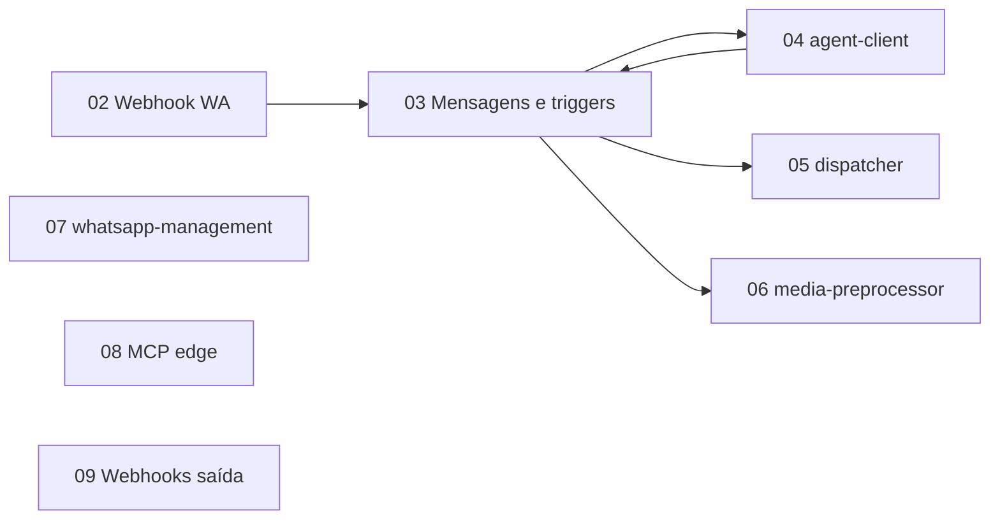

# Caso e escopo

## Levantamento do sistema (núcleo) vs. exemplos de integração

O **levantamento técnico** dos módulos **01?08**, **10**, **12?15** descreve o **sistema atual** tal como implementado neste repositório: tabelas, triggers, Edge Functions, autenticação, deploy e contratos HTTP **sem** depender de nenhum produto externo específico.

**n8n** (e menções semelhantes) aparecem apenas como **exemplo opcional** de consumidor da tabela `public.webhooks` e da API ? **não** faz parte do codebase nem do desenho obrigatório do OpenBSP. Os módulos **09**, **11** e **13** citam integrações para ilustrar **uso** dos ganchos já existentes; a semântica que importa para o sistema é **`notify_webhook`**, `net.http_post` e RLS, independentemente do destino ser n8n, Zapier ou um serviço próprio.

Party Mode (**98**) e Advanced Elicitation (**99**, **100**) misturam **análise do código** com **cenários de evolução**; separar mentalmente: fatos do repo vs. hipóteses de produto.

---

## O "caso" que esta documentação cobre

Consolidamos o cenário de análise **brownfield** do repositório **open-bsp-api** com as intenções explícitas:

1. **Entender o sistema por completo** ? arquitetura, dados, edge, deploy.
2. **Avaliar banco dockerizado / self-host** ? sem confundir "Postgres em Docker" com "stack Supabase completa".
3. **Integrar orquestração terceira** (quando desejado) ? usando ganchos existentes ou API; exemplos como n8n são **opcionais**.
4. **Evoluir processos de agentes** ? RAG, MCP, fluxo explícito, "autoaprendizado" (interpretado como **loops de melhoria**, não ML online mágico).

## O que este repositório **é**

- Backend de **WhatsApp Business Platform** (Cloud API) com **Supabase**: Postgres, Edge Functions (Deno), Auth, Storage, extensões (`pg_net`, `vault`).
- **Multi-tenant** por `organizations` e endereços em `organizations_addresses`.
- **Orquestração reativa**: triggers em `public.messages` (e outras tabelas) disparam HTTP para Edge Functions.

## O que este repositório **não é** (fronteiras)

- **Interface web completa**: o app de gestão é o projeto separado **OpenBSP UI** (ver README na raiz).
- **RAG/embeddings nativos**: não há subsistema pronto de vector store + ingestão documental acoplado ao agente; isso é **extensão** (módulo [11](./11-extensoes-rag-n8n-aprendizado.md)).
- **Motor de fine-tuning / RLHF**: fora do escopo do core; qualquer "autoaprendizado" exige **produto + dados + governança**.

## Premissas de leitura

- Você aceita que **migrations** são geradas a partir de `supabase/schemas/` e aplicadas via pipeline (ver [10](./10-rotina-deploy-ci-billing-vault.md)).
- "Mudar só o banco para Postgres Docker" sem Supabase implica **replatform** ? documentado como risco arquitetural em [99](./99-elicitacao-pre-mortem-e-riscos.md).

## Relação entre módulos

Os módulos **10** e **11** cortam transversalmente **operação**, **custo** e **evolução do produto**.

**Apêndices 12?15**: rotas HTTP consolidadas, semântica profunda de `notify_webhook`, contatos/onboarding, catálogo MCP. **98?100**: Party Mode e Advanced Elicitation (sessões 1 e 2).
