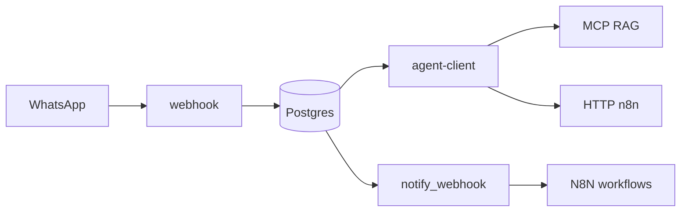

# Extensões: RAG, n8n, ?autoaprendizado?

Este módulo sintetiza **o que o core não faz** e **como estender sem quebrar a arquitetura**.

## RAG (Retrieval-Augmented Generation)

**Estado no repositório**: não há pipeline nativo de **embeddings + vector store + ingestão documental** acoplado ao `agent-client`. A busca semântica não aparece como tabela padrão no núcleo analisado.

**Caminhos recomendados**

1. **MCP de retrieval**  
   Implementar servidor MCP com ferramentas `search` / `cite` sobre Postgres (**pgvector**), object storage, ou API externa. Registrar em `AgentExtra.tools` com `type: "mcp"` ([04](./04-rotina-agent-client.md)).

2. **Tool HTTP**  
   Serviço interno (ex.: FastAPI) que expõe `/query?q=` retornando trechos; allowlist no `HTTPTools`.

3. **Tool SQL**  
   Consultas controladas a tabelas de conhecimento curadas (com RLS e views seguras).

4. **Pré-processamento**  
   O `media-preprocessor` já **enriquece arquivos** para o LLM ? é ?RAG leve? para anexos, não substitui base documental corporativa completa.

## n8n

- **Event-driven**: [09](./09-rotina-webhooks-saida-integracoes.md) ? empurrar eventos para workflows.
- **Command-driven**: n8n chama **PostgREST** ou **Edge** com **API keys** para ações (criar registro, disparar fluxo humano).

## ?Autoaprendizado?

Interpretação **operacional** (evita expectativa falsa de ML online):

| Mecanismo | Descrição |
|-----------|-----------|
| **Feedback humano** | Operador marca resposta como incorreta; grava em tabela auxiliar; job atualiza FAQs ou remove trecho do índice. |
| **Analytics** | Agregar `logs` + métricas de conversão; **não** implica retreino do modelo base. |
| **Fine-tuning** | Processo **offline**, fora do hot path; exportar dados com governança. |

**Primeiros princípios**: o modelo em produção **não** muda pesos por si; quem ?aprende? é o **sistema** (políticas, base de conhecimento, prompts versionados).

## Mapa de extensão sem replatform

## Referências

- README: secção AI agents e desacoplamento de agentes avançados
- [04](./04-rotina-agent-client.md), [08](./08-rotina-mcp-servidor-api.md), [09](./09-rotina-webhooks-saida-integracoes.md)
